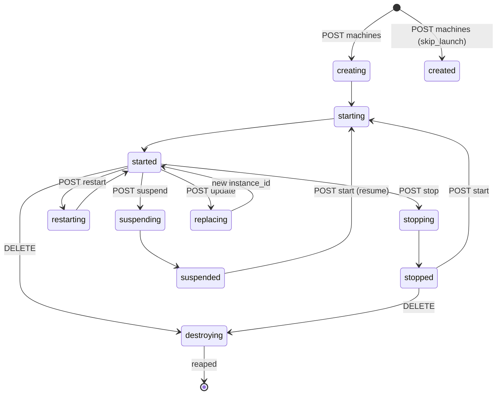

# Fidelity

This page describes what mudflaps models faithfully and, just as importantly,
what it deliberately does not.

## Machine lifecycle

A machine moves through transient states into a resting state. mudflaps sets the
transient state as soon as a request arrives, then advances to the resting state
after a short, configurable delay driven by an injected clock. In tests the
clock is a fake, so transitions are instantaneous and deterministic.

The states the emulator actually enters fall into three groups:

- Resting: `created`, `started`, `stopped`, `suspended`.
- Transient: `creating`, `starting`, `stopping`, `restarting`, `suspending`,
  `replacing`, `destroying`.
- Terminal: `destroyed` (a destroyed machine is reaped from the store), and
  `replaced` for a superseded version.

A `skip_launch` create rests directly at `created` rather than booting. A
destroyed machine is removed, so a subsequent operation returns `404` rather
than resurrecting it.

## Leases and nonces

A lease grants its holder exclusive rights to mutate a machine. The holder
proves ownership by echoing the lease nonce in the `fly-machine-lease-nonce`
header.

- Acquire (`POST .../lease`) returns a nonce and an expiry.
- A second acquire while a lease is held returns `409`.
- A mutating operation (update, start, stop, restart, suspend, cordon, destroy)
  by a caller that does not present the held nonce is rejected `409`.
- Leases carry a TTL and expire on the injected clock; after expiry the machine
  is unguarded again.
- Refresh and release require the matching nonce.

## The wait endpoint

`GET /v1/apps/{app}/machines/{id}/wait?state=&version=&timeout=` blocks until the
machine reaches a target state, then returns `200 {"ok":true}`. `state` may be
repeated — any of the requested states satisfies the wait — and defaults to
`started`. `version` scopes the wait to a specific machine version
(`instance_id`); `instance_id` is also accepted. If the timeout elapses first it
returns `408`. The timeout is given in seconds and clamped to the range
[1s, 60s], matching the real service.

## Version churn

Updating a machine mints a fresh `instance_id` unique to the new version,
synchronously, so the update response already carries the new identity (only the
boot to `started` is async). The prior version is marked `replaced`, and mudflaps
keeps the instance-ID history internally.

## What mudflaps does not do

mudflaps is an API emulator, not a virtualization platform. It does not:

- Run real microVMs or execute container images.
- Pull, resolve, or validate images beyond storing the reference you send.
- Provide real networking, private IPs that route, or service load balancing.
- Enforce quotas, billing, regions, or authentication.
- Persist across restarts; all state is in memory.

These boundaries are intentional. The goal is a faithful model of the API's
stateful behavior, which is what a client needs to test against, without the
weight of the real platform.
